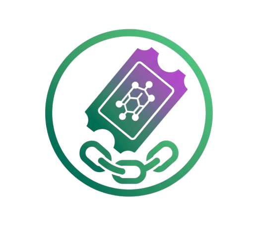

<a id="readme-top"></a>

<!-- PROJECT LOGO -->
<br />
<div align="center">
  <a href="https://github.com/0x4nud33p/poaponsol">
    
  </a>

  <h3 align="center">poaponsol</h3>

  <p align="center">
    Proof of Attendance Protocol on Solana.
    <br />
    <a href="https://poaponsol.vercel.app/">View Demo</a>
    &middot;
    <a href="https://github.com/0x4nud33p/poaponsol/issues/new?labels=bug&template=bug-report---.md">Report Bug</a>
    &middot;
    <a href="https://github.com/0x4nud33p/poaponsol/issues/new?labels=enhancement&template=feature-request---.md">Request Feature</a>
  </p>
</div>


<!-- TABLE OF CONTENTS -->
<!-- <details>
  <summary>Table of Contents</summary>
  <ol>
    <li>
      <a href="#about-the-project">About The Project</a>
      <ul>
        <li><a href="#built-with">Built With</a></li>
      </ul>
    </li>
    <li>
      <a href="#getting-started">Getting Started</a>
      <ul>
        <li><a href="#prerequisites">Prerequisites</a></li>
        <li><a href="#installation">Installation</a></li>
      </ul>
    </li>
    <li><a href="#usage">Usage</a></li>
    <li><a href="#roadmap">Roadmap</a></li>
    <li><a href="#contributing">Contributing</a></li>
    <li><a href="#license">License</a></li>
    <li><a href="#contact">Contact</a></li>
    <li><a href="#acknowledgments">Acknowledgments</a></li>
  </ol>
</details> -->


<!-- ABOUT THE PROJECT -->
## About The Project

PoaponSol is a POAP-style attendance protocol on Solana. Event organizers can create an on-chain event collection using Metaplex, and attendees mint attendance NFTs linked to that event. These NFTs serve as verifiable on-chain proofs of participation.

* On-chain event creation via collection NFTs
* Attendance NFTs minted under verified collections
* Clean organizer → attendee workflow
* Secure mint flow with wallet verification

<!-- GETTING STARTED -->
## Getting Started

This is an example of how you may give instructions on setting up your project locally.
To get a local copy up and running follow these simple example steps.

### Installation

_Below is an example of how you can instruct your audience on installing and setting up your app. This template doesn't rely on any external dependencies or services._

1. Clone the repo
   ```sh
   git clone https://github.com/0x4nud33p/poaponsol.git
   ```
2. Install NPM packages in root, client and client folders
   ```sh
    yarn install # in root folder
    cd client
    yarn install # in client folder
   ```
3. Install anchor dependicies 
   ```sh
   anchor build
   ```
4. Deploy the program 
   ```sh
   anchor build
   anchor deploy
   ```

<p align="right">(<a href="#readme-top">back to top</a>)</p>


<!-- USAGE EXAMPLES -->
## Usage

Usage
### Organizer Flow

* Create an event → generates a verified collection NFT
* Share event mint link or QR with attendees

### Attendee Flow

* Connect wallet   
* Mint attendance NFT linked to the event’s collection
* View NFT in wallet/gallery


<!-- CONTRIBUTING -->
## Contributing

Contributions are what make the open source community such an amazing place to learn, inspire, and create. Any contributions you make are **greatly appreciated**.

If you have a suggestion that would make this better, please fork the repo and create a pull request. You can also simply open an issue with the tag "enhancement".
Don't forget to give the project a star! Thanks again!

1. Fork the Project
2. Create your Feature Branch (`git checkout -b feature/AmazingFeature`)
3. Commit your Changes (`git commit -m 'Add some AmazingFeature'`)
4. Push to the Branch (`git push origin feature/AmazingFeature`)
5. Open a Pull Request

<!-- CONTACT -->
## Contact

[@0x4nud33p](https://x.com/0x4nud33p)

<p align="right">(<a href="#readme-top">back to top</a>)</p>
